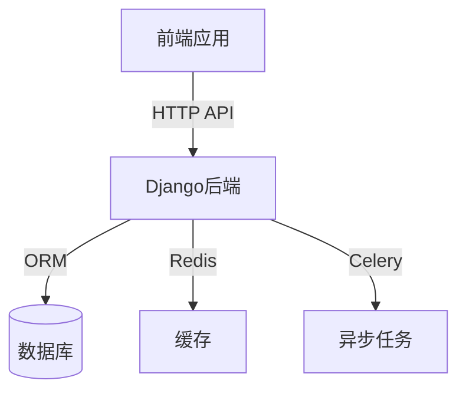

# 学习网站后端技术文档

## 1. 系统概述
### 1.1 系统架构图


### 1.2 技术栈
| 组件 | 技术选型 | 版本 |
|------|----------|------|
| 后端框架 | Django | 5.1.7 |
| API框架 | Django REST Framework | 3.14.0 |
| 认证方案 | JWT (django-rest-framework-simplejwt) | 5.3.0 |
| 数据库 | SQLite (开发) / PostgreSQL (生产) | 3.42.0 |
| 跨域处理 | django-cors-headers | 4.3.1 |
| 图片处理 | Pillow | 10.1.0 |

### 1.2 系统架构图
```
+----------------+     +----------------+     +----------------+
|                |     |                |     |                |
|  前端应用      |<--->|  Django后端    |<--->|     数据库      |
|                |     |                |     |                |
+----------------+     +----------------+     +----------------+
```

## 2. 数据库设计

### 2.1 用户模块（users）
- 用户表（User）
  - id: 主键
  - username: 用户名
  - email: 邮箱
  - password: 密码
  - role: 角色（学生/教师/管理员）
  - created_at: 创建时间
  - updated_at: 更新时间

### 2.2 课程模块（courses）
- 课程表（Course）
  - id: 主键
  - title: 课程标题
  - description: 课程描述
  - chapter: 章节编号
  - teacher: 教师（外键关联User）
  - created_at: 创建时间
  - updated_at: 更新时间

- 课程内容表（CourseContent）
  - id: 主键
  - course: 所属课程（外键关联Course）
  - title: 内容标题
  - content: 内容详情
  - order: 排序
  - created_at: 创建时间

## 3. 核心功能模块

### 3.1 用户管理模块
- 用户注册
- 用户登录（JWT认证）
- 用户信息管理
- 角色权限控制

### 3.2 课程管理模块
- 课程CRUD操作
- 课程内容管理
- 课程搜索和过滤（支持按章节筛选）
- 课程排序（支持按章节排序）
- 课程评分和评论

### 3.3 文件处理模块
- 图片上传和处理
- 课程资料管理
- 文件格式验证

## 4. 安全性设计

### 4.1 认证机制
- 使用JWT进行身份认证
- Token过期策略
- 刷新Token机制

### 4.2 权限控制
- 基于角色的访问控制（RBAC）
- API访问权限控制
- 资源访问控制

## 5. 部署说明

### 5.1 环境要求
- Python 3.12+
- Django 5.1.7
- 其他依赖见requirements.txt

### 5.2 部署步骤
1. 安装依赖：`pip install -r requirements.txt`
2. 数据库迁移：
   ```bash
   python manage.py makemigrations
   python manage.py migrate
   ```
3. 创建超级用户：`python manage.py createsuperuser`
4. 启动服务：`python manage.py runserver`

## 6. 开发规范

### 6.1 代码规范
- 遵循PEP 8编码规范
- 使用类型注解
- 编写单元测试
- 代码注释规范

### 6.2 API设计规范
- RESTful API设计
- 统一的响应格式
- 合理的状态码使用
- 详细的API文档